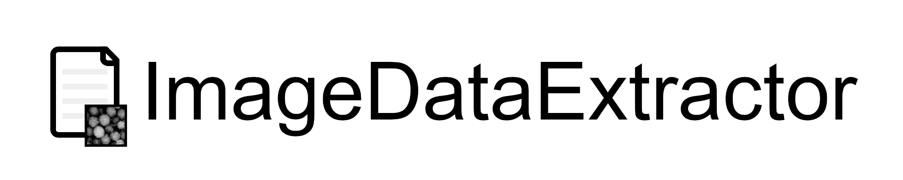

[](https://travis-ci.com/by256/imagedataextractor)
[](https://badge.fury.io/py/imagedataextractor)
[](https://github.com/by256/imagedataextractor/blob/master/LICENSE)


**imagedataextractor** is a Python library for nanoparticle electron microscopy image quantification.

Try the online [Demo](https://imagedataextractor.org/demo).

## Features

- Automatic detection and download of microscopy images from scientific articles.
- Particle segmentation with uncertainty quantification.
- Particle localization.
- Automatic scalebar detection (reading and measurement).
- Particle size distributions.
- Locations, sizes and aspect ratios of all particles in an image (in the form of a .csv file).
- Radial distribution functions of extracted particle systems.

## Installation

**imagedataextractor** requires Python 3.7 or above. We strongly recommend the use of a [virtual environment](https://packaging.python.org/guides/installing-using-pip-and-virtual-environments/) for installation, as **imagedataextractor** requires specific versions of its requirements to be installed in order to function as intended.

#### Install Tesseract

**imagedataextractor** requires [Tesseract 4](https://tesseract-ocr.github.io/tessdoc/Installation.html). Installation instructions for Tesseract can be found [here](https://tesseract-ocr.github.io/tessdoc/Installation.html). On Linux, this is very simple:

```bash
sudo apt-get install tesseract-ocr libtesseract-dev
```

#### Installation with `pip` (recommended)
```bash
pip install imagedataextractor
```

#### Installation from source

1. Clone the repo and move into the directory:


```bash
git clone https://github.com/by256/imagedataextractor.git
cd imagedataextractor
```

2. Activate your virtual environment.

3. Install:

```bash
python setup.py install
```

## Usage

Simply provide as input a path to an image or a document, or a path to a directory of images and/or documents.

```python
import imagedataextractor as ide

image_path = '<path/to/image>'
data = ide.extract(image_path)

# view extracted data as a pandas DataFrame
df = data.to_pandas()

# retrieve extracted scalebar data
sb_text = data.scalebar.text
conversion = data.scalebar.conversion  # pixels to meters

# resulting particle segmentations
seg = data.segmentation
```

If the input image is a figure containing a panel of images, these will be split and extraction will be performed on each sub-image separately.

See the [example notebook](https://github.com/by256/imagedataextractor/blob/master/examples/example-notebook.ipynb). A more detailed usage guide can be found in the [Documentation](https://imagedataextractor.org/docs/usage).

## Citing

If you use **imagedataextractor** in your work, please cite the following works:


B. Yildirim, J. M. Cole, "Bayesian Particle Instance Segmentation for Electron Microscopy Image Quantification", *J. Chem. Inf. Model.* (2021)  https://doi.org/10.1021/acs.jcim.0c01455

K. T. Mukaddem, E. J. Beard, B. Yildirim, J. M. Cole, "ImageDataExtractor: A Tool to Extract and Quantify Data from Microscopy Images", *J. Chem. Inf. Model.* (2019) https://doi.org/10.1021/acs.jcim.9b00734

## Funding

This project was financially supported by the [Science and Technology Facilities Council (STFC)](https://stfc.ukri.org/) and the [Royal Academy of Engineering](https://www.raeng.org.uk/) (RCSRF1819\7\10).

## License

[](http://badges.mit-license.org)
